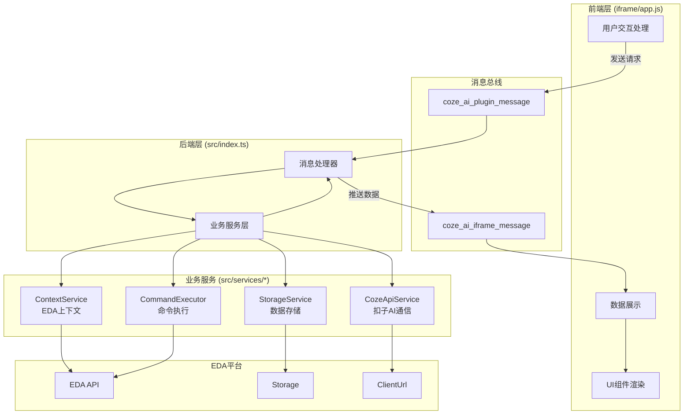
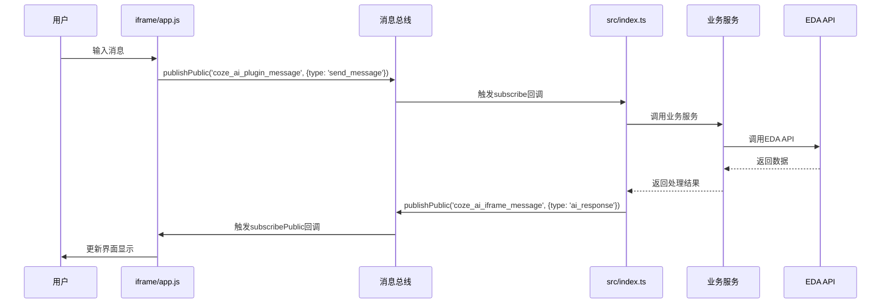

## 产品概述

重构扣子AI插件架构,实现清晰的前后端分离设计。将src/index.ts作为业务逻辑层(后端),负责所有EDA API调用和扣子AI网络请求;将iframe/app.js作为纯UI展示层(前端),仅负责用户交互和界面渲染;通过消息总线实现双向通信。

## 核心功能

- **职责分离**: src/index.ts处理所有业务逻辑、API调用、数据存储;iframe/app.js仅处理UI渲染和用户交互
- **消息总线通信**: 前端通过`coze_ai_plugin_message`频道向后端发送请求;后端通过`coze_ai_iframe_message`频道向前端推送数据
- **业务服务封装**: 保留并完善四大服务类(CozeApiService、ContextService、CommandExecutor、StorageService),所有业务逻辑由后端调用
- **纯UI前端**: iframe/app.js移除所有直接的EDA API调用和业务逻辑,专注于DOM操作和用户体验
- **数据流向清晰**: 用户操作→前端发送消息→后端处理业务→后端推送结果→前端更新UI

## 技术栈

- **开发语言**: TypeScript (后端业务层)、JavaScript (前端UI层)
- **通信机制**: EDA消息总线 (eda.sys_MessageBus)
- **数据存储**: EDA Storage API (eda.sys_Storage)
- **网络请求**: EDA ClientUrl API (eda.sys_ClientUrl)
- **构建工具**: esbuild + TypeScript

## 系统架构

### 整体架构模式

采用标准的前后端分离架构,通过消息总线实现解耦:



### 模块划分

#### 后端业务层 (src/)

**职责**: 插件生命周期管理、消息路由、业务逻辑处理、API调用

- **src/index.ts**:
- 插件入口和生命周期(activate, openCozePanel)
- 消息总线监听和分发
- 请求处理器(handleGetConfig, handleSendMessage等)
- IFrame消息推送

- **src/services/cozeApiService.ts**:
- 封装扣子AI HTTP API调用
- 请求体构建和响应解析
- 会话管理

- **src/services/contextService.ts**:
- EDA上下文数据收集
- 项目、文档、器件信息获取
- 上下文缓存管理

- **src/services/commandExecutor.ts**:
- 命令解析和执行
- EDA API调用(创建项目、搜索器件、添加器件等)
- 执行结果追踪

- **src/services/storageService.ts**:
- 配置数据读写
- 对话历史管理
- 会话ID持久化

#### 前端UI层 (iframe/)

**职责**: 界面渲染、用户交互、状态展示(不直接调用任何业务逻辑)

- **iframe/app.js**:
- DOM元素管理
- 用户输入处理
- 消息UI渲染
- 设置界面管理
- 通过消息总线与后端通信

- **iframe/index.html**:
- 页面结构定义

- **iframe/styles.css**:
- 样式定义

### 数据流



## 实现细节

### 核心目录结构

```
/workspace/
├── src/                          # 后端业务层(已存在,需优化)
│   ├── index.ts                  # 主入口,消息路由
│   ├── services/                 # 业务服务(已存在,保持不变)
│   │   ├── cozeApiService.ts     # 扣子AI通信
│   │   ├── contextService.ts     # EDA上下文
│   │   ├── commandExecutor.ts    # 命令执行
│   │   └── storageService.ts     # 数据存储
│   └── types/                    # TypeScript类型定义
│       ├── command.ts
│       ├── context.ts
│       └── conversation.ts
├── iframe/                       # 前端UI层(需重构)
│   ├── app.js                    # UI逻辑(需移除业务代码)
│   ├── index.html                # 页面结构
│   └── styles.css                # 样式定义
└── extension.json                # 插件配置
```

### 关键代码结构

#### 消息协议定义

后端和前端通过标准化的消息格式通信:

```typescript
// 前端→后端请求格式
interface PluginRequest {
	type: 'get_config' | 'save_config' | 'get_history' | 'clear_history' | 'send_message';
	data?: any; // 可选数据
}

// 后端→前端响应格式
interface IFrameResponse {
	type: 'config_loaded' | 'history_loaded' | 'ai_response' | 'command_result' | 'connection_status' | 'error';
	data: any;
}
```

#### 后端消息处理器模式

src/index.ts中统一的消息处理:

```typescript
function setupMessageListener(): void {
	eda.sys_MessageBus.subscribePublic('coze_ai_plugin_message', async (message) => {
		const { type, data } = message;
		switch (type) {
			case 'get_config':
				await handleGetConfig();
				break;
			case 'save_config':
				await handleSaveConfig(data);
				break;
			case 'send_message':
				await handleSendMessage(data);
				break;
			// ...其他处理器
		}
	});
}
```

#### 前端消息发送器模式

iframe/app.js中统一的消息发送:

```javascript
function sendMessageToPlugin(message) {
	window.eda.sys_MessageBus.publishPublic('coze_ai_plugin_message', message);
}

// 使用示例
sendMessageToPlugin({ type: 'send_message', data: { message: userInput } });
```

### 技术实现方案

#### 1. 消息总线通信机制

**问题**: 需要确保前后端消息可靠传递
**方案**:

- 后端使用`eda.sys_MessageBus.subscribePublic('coze_ai_plugin_message')`监听
- 前端使用`eda.sys_MessageBus.publishPublic('coze_ai_plugin_message')`发送
- 后端使用`eda.sys_MessageBus.publishPublic('coze_ai_iframe_message')`推送
- 前端使用`eda.sys_MessageBus.subscribePublic('coze_ai_iframe_message')`接收

**实现步骤**:

1. 在src/index.ts的setupMessageListener中订阅插件消息
2. 在iframe/app.js中通过publishPublic发送请求
3. 后端处理完成后通过publishPublic推送响应
4. 前端通过subscribePublic接收并更新UI

#### 2. 前端职责清理

**问题**: iframe/app.js中可能存在直接调用window.eda的业务逻辑
**方案**:

- 审查并移除所有直接的EDA API调用
- 将业务逻辑转换为消息发送
- 仅保留DOM操作、事件监听、UI渲染

**实现步骤**:

1. 扫描iframe/app.js中的window.eda调用
2. 将业务调用改为sendMessageToPlugin
3. 接收后端推送的数据并更新界面
4. 保留消息总线的访问(仅用于通信)

#### 3. 后端业务增强

**问题**: src/index.ts需要完整处理所有业务逻辑
**方案**:

- 保持现有的四大服务类不变
- 在index.ts中完善消息处理器
- 确保所有EDA API调用都在后端完成
- 增强错误处理和日志记录

**实现步骤**:

1. 验证所有消息类型都有对应处理器
2. 确保服务类的正确初始化和调用
3. 添加统一的错误捕获和响应
4. 完善执行日志记录

#### 4. 类型安全保障

**问题**: 消息通信需要类型约束
**方案**:

- 在src/types/中定义消息协议接口
- 后端使用TypeScript类型检查
- 前端通过JSDoc注释提供类型提示

### 性能优化

- **上下文缓存**: ContextService已实现5秒缓存,避免频繁API调用
- **历史消息限制**: StorageService限制最大历史记录数(默认50条)
- **异步处理**: 所有业务操作使用async/await,避免阻塞

### 日志规范

遵循现有的日志模式:

- 后端: `console.log('[CozeAI] ...')`, `console.error('[CozeAI] ...')`
- 前端: `console.log('[IFrame] ...')`, `console.error('[IFrame] ...')`
- 服务类: `console.log('[ServiceName] ...')`e.log('[ServiceName] ...')`
