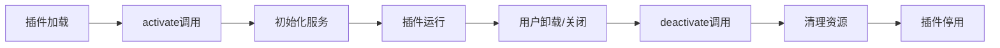
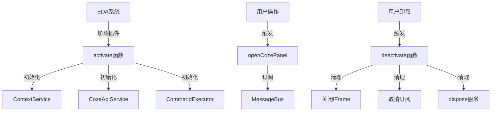

## 产品概述

修正嘉立创EDA插件的生命周期函数签名,使其符合官方插件开发规范。当前插件使用了错误的activate函数签名和资源管理方式,需要按照嘉立创EDA插件系统的标准实现方式进行修正。

## 核心功能

- **修正activate函数签名**: 将当前的`activate(status?: 'onStartupFinished', arg?: string)`改为标准签名`activate(api: any)`,移除VS Code风格的参数
- **实现deactivate清理函数**: 添加标准的deactivate函数,在插件停用时清理全局资源,包括关闭IFrame面板、取消消息订阅、清除服务实例
- **移除不必要的注册代码**: 删除激活函数中的命令注册逻辑,因为菜单已在extension.json中声明式配置
- **为服务类添加dispose方法**: 为ContextService、CozeApiService、CommandExecutor等服务类添加资源清理方法,支持优雅关闭

## 技术栈

- **语言**: TypeScript
- **平台**: 嘉立创EDA专业版插件系统
- **API**: 嘉立创EDA扩展API (eda.sys*\*, eda.dmt*_, eda.sch\__, eda.pcb\_\*)
- **存储**: eda.sys_Storage API
- **消息总线**: eda.sys_MessageBus API

## 系统架构

### 插件生命周期模型



### 模块划分

**主入口模块 (src/index.ts)**

- 职责: 实现activate和deactivate生命周期函数,管理全局服务实例
- 关键技术: TypeScript模块导出,全局变量管理
- 对外接口: `activate(api: any)`, `deactivate()`, `openCozePanel()`, `about()`

**服务模块 (src/services/)**

- 职责: 提供核心业务逻辑,支持资源清理
- 关键技术: 类封装,dispose模式
- 新增接口: 各服务类添加`dispose(): void`方法

### 数据流



## 实现细节

### 核心目录结构

```
workspace/
├── src/
│   ├── index.ts                    # 修改: activate/deactivate函数
│   └── services/
│       ├── contextService.ts       # 修改: 添加dispose方法
│       ├── cozeApiService.ts       # 修改: 添加dispose方法
│       ├── commandExecutor.ts      # 修改: 添加dispose方法
│       └── storageService.ts       # 无需修改(静态类)
```

### 关键代码结构

**标准生命周期函数签名**

```typescript
// 激活函数 - 标准签名
export function activate(api: any): void {
	// 初始化全局服务
	contextService = new ContextService();
	cozeApiService = new CozeApiService(config);
	commandExecutor = new CommandExecutor(contextService);
}

// 停用函数 - 资源清理
export function deactivate(): void {
	// 关闭IFrame面板
	if (currentIframeId) {
		eda.sys_IFrame.closeIFrame(currentIframeId);
	}
	// 取消消息订阅
	eda.sys_MessageBus.unsubscribePublic('coze_ai_plugin_message');
	// 清理服务实例
	contextService?.dispose();
	cozeApiService?.dispose();
	commandExecutor?.dispose();
}
```

**服务类Dispose接口**

```typescript
// 所有服务类统一实现
class ServiceClass {
	dispose(): void {
		// 清理缓存
		// 取消订阅
		// 释放引用
	}
}
```

### 技术实现方案

#### 1. 修正activate函数

**问题**: 当前使用`activate(status?: 'onStartupFinished', arg?: string)`,这是VS Code风格的签名
**解决方案**: 改为标准签名`activate(api: any)`,移除status和arg参数
**实现步骤**:

1. 修改函数签名为`activate(api: any): void`
2. 移除对status和arg参数的引用
3. 保持现有初始化逻辑不变
4. 移除`// eslint-disable-next-line @typescript-eslint/no-unused-vars`注释

#### 2. 实现deactivate函数

**问题**: 当前缺少deactivate函数,资源无法清理
**解决方案**: 添加deactivate函数处理资源释放
**实现步骤**:

1. 在index.ts中添加`export function deactivate(): void`
2. 关闭当前打开的IFrame面板
3. 取消消息总线订阅
4. 调用各服务的dispose方法
5. 清空全局变量引用

#### 3. 为服务类添加dispose方法

**问题**: 服务类缺少统一的清理接口
**解决方案**: 为每个服务类添加dispose方法
**实现步骤**:

1. ContextService: 清除缓存,重置计数器
2. CozeApiService: 清除会话ID,重置配置
3. CommandExecutor: 清除执行历史,取消引用contextService
4. StorageService: 无需修改(静态工具类)

#### 4. 移除setupMessageListener的自动调用

**问题**: 代码末尾注释掉的`setupMessageListener()`不应存在
**解决方案**: 完全删除该行,消息监听只在openCozePanel时初始化
**实现步骤**:

1. 删除index.ts最后一行的注释代码
2. 确保setupMessageListener只在openCozePanel中调用

### 集成要点

- **消息订阅管理**: 在deactivate中正确取消MessageBus订阅,避免内存泄漏
- **IFrame生命周期**: 确保插件停用时关闭所有打开的IFrame窗口
- **服务依赖关系**: CommandExecutor依赖ContextService,清理时先清理CommandExecutor
- **配置持久化**: deactivate不清理Storage中的配置和历史记录,保留用户数据

## 技术考虑

### 资源清理顺序

1. 首先关闭UI组件(IFrame)
2. 然后取消事件订阅(MessageBus)
3. 最后清理业务服务(按依赖倒序)

### 错误处理

- deactivate函数必须包含try-catch,确保清理逻辑不会因异常中断
- 每个清理步骤独立处理,一个步骤失败不影响其他步骤

### 兼容性

- 符合嘉立创EDA插件规范2.3.0+版本
- 不使用VS Code特有的ExtensionContext概念
- 使用声明式菜单注册(extension.json),不需要api.registerCommand()
