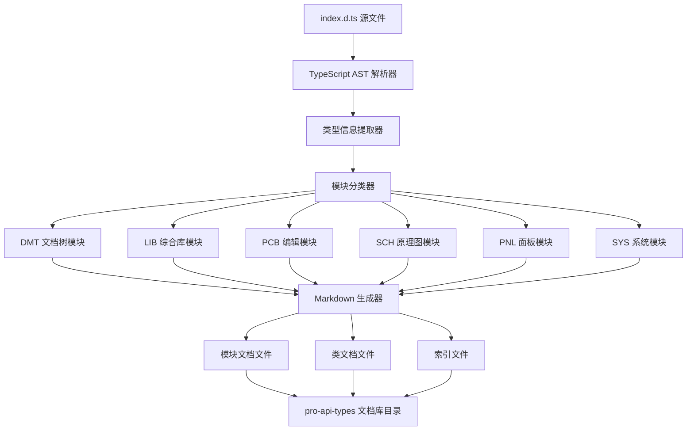
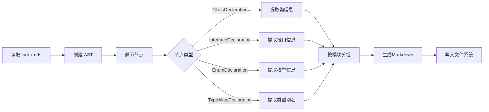

## 产品概述

为 @jlceda/pro-api-types TypeScript 类型定义文件创建一套结构化、易于查阅的学习文档库。该文档库将超大型 API 类型文件（16,475行代码）按照功能模块进行分类整理，生成独立的 Markdown 文档文件，方便开发者学习和查阅嘉立创EDA专业版扩展API。

## 核心功能

- **模块化文档结构**：将API按6大功能模块（DMT文档树、LIB综合库、PCB编辑、SCH原理图、PNL面板、SYS系统）分类组织，每个模块独立成文件夹
- **类级文档拆分**：每个类或相关类组生成独立的Markdown文件，避免单一文件过大导致的阅读和维护困难
- **完整API文档**：包含类的描述、方法签名、参数说明、返回值、相关枚举和接口定义
- **交叉引用系统**：文档间通过相对路径链接，便于在不同模块和类之间快速导航
- **索引目录**：生成总览README和各模块索引，提供清晰的文档导航结构
- **代码示例**：为核心API提供TypeScript使用示例，帮助开发者快速上手

## 技术栈

- **开发语言**：TypeScript 5.7.3
- **运行环境**：Node.js >= 20.5.0
- **文件处理**：Node.js fs/promises API
- **类型解析**：@microsoft/tsdoc + TypeScript Compiler API
- **Markdown生成**：纯字符串模板拼接
- **项目结构**：基于现有 pro-api-sdk 项目扩展

## 系统架构



## 模块划分

### 类型解析模块

- **职责**：解析 TypeScript 声明文件，提取类、接口、枚举、类型别名等定义
- **技术**：TypeScript Compiler API (ts.createSourceFile, ts.forEachChild)
- **关键接口**：
- `parseTypeDefinitions(filePath: string): TypeDefinitions`
- `extractClassInfo(node: ts.ClassDeclaration): ClassInfo`
- `extractInterfaceInfo(node: ts.InterfaceDeclaration): InterfaceInfo`

### 模块分类模块

- **职责**：根据类名前缀将API分类到6大功能模块
- **分类规则**：
- DMT\_\* → 文档树模块
- LIB\_\* → 综合库模块
- PCB\_\* → PCB编辑模块
- SCH\_\* → 原理图模块
- PNL\_\* → 面板模块
- SYS\_\* → 系统模块
- **关键接口**：`categorizeByModule(classes: ClassInfo[]): ModuleMap`

### Markdown生成模块

- **职责**：将结构化API数据转换为格式化的Markdown文档
- **技术**：字符串模板 + 递归结构处理
- **关键接口**：
- `generateClassDoc(classInfo: ClassInfo): string`
- `generateModuleIndex(module: Module): string`
- `generateMainReadme(modules: Module[]): string`

### 文件输出模块

- **职责**：将生成的Markdown内容写入文件系统
- **技术**：Node.js fs.promises (mkdir, writeFile)
- **目录结构**：

```
/workspace/pro-api-types/
├── README.md                    # 总索引
├── DMT-文档树/
│   ├── README.md               # DMT模块索引
│   ├── DMT_Board.md            # 板子管理类
│   ├── DMT_EditorControl.md    # 编辑器控制类
│   └── ...
├── LIB-综合库/
│   ├── README.md
│   ├── LIB_Device.md
│   └── ...
├── PCB-编辑/
│   ├── README.md
│   └── ...
├── SCH-原理图/
│   ├── README.md
│   └── ...
├── PNL-面板/
│   ├── README.md
│   └── ...
└── SYS-系统/
    ├── README.md
    └── ...
```

## 数据流



## 实现细节

### 核心数据结构

**TypeDefinitions 接口**：存储解析后的所有类型定义

```typescript
interface TypeDefinitions {
	classes: ClassInfo[];
	interfaces: InterfaceInfo[];
	enums: EnumInfo[];
	types: TypeAliasInfo[];
}
```

**ClassInfo 接口**：表示一个类的完整信息

```typescript
interface ClassInfo {
	name: string;
	description: string;
	module: string; // DMT, LIB, PCB, SCH, PNL, SYS
	methods: MethodInfo[];
	properties: PropertyInfo[];
	remarks?: string;
	deprecated?: boolean;
	beta?: boolean;
}
```

**MethodInfo 接口**：表示类方法的信息

```typescript
interface MethodInfo {
	name: string;
	description: string;
	parameters: ParameterInfo[];
	returnType: string;
	returnDescription?: string;
	visibility: 'public' | 'private' | 'protected';
	async: boolean;
	beta?: boolean;
}
```

### 技术实现要点

**TypeScript AST 解析**

```typescript
import * as ts from 'typescript';

function parseTypeDefinitions(filePath: string): TypeDefinitions {
	const sourceCode = fs.readFileSync(filePath, 'utf-8');
	const sourceFile = ts.createSourceFile(filePath, sourceCode, ts.ScriptTarget.Latest, true);

	const definitions: TypeDefinitions = {
		classes: [],
		interfaces: [],
		enums: [],
		types: [],
	};

	function visit(node: ts.Node) {
		if (ts.isClassDeclaration(node)) {
			definitions.classes.push(extractClassInfo(node));
		}
		// 递归遍历子节点
		ts.forEachChild(node, visit);
	}

	visit(sourceFile);
	return definitions;
}
```

**Markdown 文档生成**

- 类文档包含：标题、描述、方法列表（含参数表格）、相关类型链接
- 使用表格展示方法参数和返回值
- 添加代码块展示类型签名
- 使用相对路径链接关联的接口和枚举

**文件组织策略**

- 每个模块一个文件夹，使用中文名称便于识别
- 模块内按字母顺序组织类文档
- 每个模块的README.md列出该模块下的所有类
- 根目录README.md提供6大模块的概览和快速导航

## 性能优化

- **流式处理**：采用流式读取大文件，避免内存溢出
- **并行写入**：使用 Promise.all 并行写入多个文档文件
- **增量更新**：支持检测文件变化，仅更新修改的文档

## 日志记录

- 遵循项目现有的日志规范
- 记录解析进度、模块分类统计、文件生成结果
- 输出格式：`[文档生成器] 已解析 68 个类，生成 6 个模块`

## Agent 扩展

### SubAgent

- **code-explorer**
- 用途：深度探索 @jlceda/pro-api-types/index.d.ts 文件，识别所有类、接口、枚举的完整定义和依赖关系
- 预期结果：获得完整的类型定义清单，包括每个类的方法签名、参数类型、关联接口等详细信息，为文档生成提供准确的数据源
