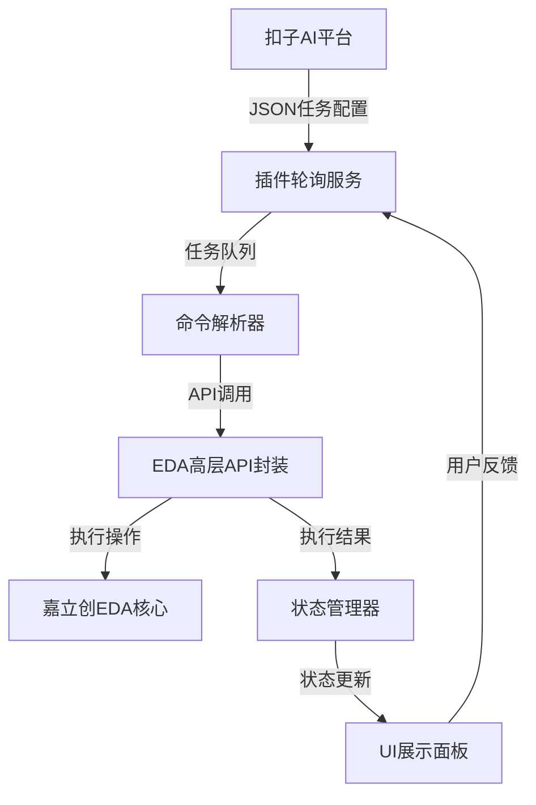
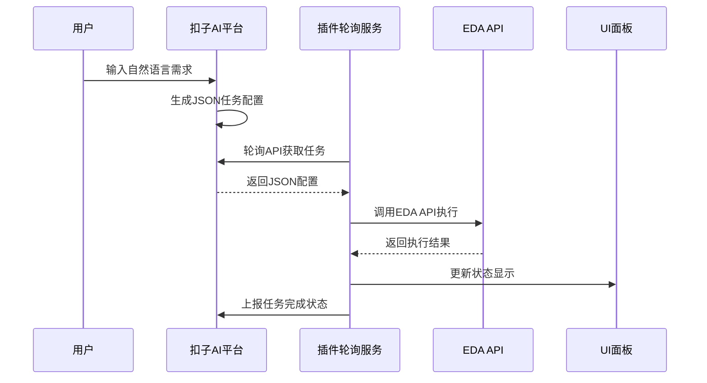

## 产品概述

开发嘉立创EDA专业版的AI插件，构建扣子AI平台与EDA软件的集成架构。用户通过自然语言在扣子平台输入电路设计需求，插件通过轮询扣子API获取任务，使用预定义的高层API配合JSON配置执行EDA操作，实现自然语言驱动的电路设计。

## 核心功能

- 配置面板：设置扣子API端点、认证令牌、轮询间隔等参数
- 任务轮询：插件主动轮询扣子API获取待执行任务
- 命令执行：解析JSON配置调用预定义EDA API执行电路设计
- 状态显示：实时展示任务执行状态、进度和结果
- 操作日志：记录命令历史和执行详情，支持日志查看
- API封装：提供高层API封装，支持项目创建、器件操作、原理图编辑等
- 错误处理：捕获和上报执行过程中的错误信息
- 本地结果展示：MVP阶段在本地面板显示操作结果，支持查看设计详情

## 技术栈

- 前端框架：TypeScript + 原生JavaScript（嘉立创EDA插件环境）
- 构建工具：esbuild
- HTTP通信：eda.sys_ClientUrl.request()
- 数据存储：eda.sys_Storage API
- UI界面：eda.sys_IFrame + HTML/CSS

## 架构设计

### 系统架构

插件采用分层架构，包含配置层、通信层、执行层和展示层。插件通过轮询机制主动拉取扣子平台任务，解析JSON配置后调用预定义EDA API执行操作，结果本地展示。



### 模块划分

- **配置模块**：管理API配置、轮询参数，使用eda.sys_Storage持久化
- **通信模块**：实现扣子API轮询，处理任务拉取和响应上报
- **执行模块**：解析JSON配置，调用EDA API执行电路设计操作
- **UI模块**：提供配置面板、状态显示、操作日志界面
- **日志模块**：记录操作历史，支持查看和导出

### 数据流

用户在扣子输入需求 → AI生成JSON配置 → 插件轮询获取任务 → 解析配置调用EDA API → 执行电路设计 → 更新状态显示 → 记录日志



## 实现细节

### 核心目录结构

```
/workspace/
├── src/
│   ├── index.ts              # 插件入口（修改：添加AI插件初始化）
│   ├── config/
│   │   └── config.ts         # 新增：配置管理模块
│   ├── polling/
│   │   ├── poller.ts         # 新增：扣子API轮询服务
│   │   └── types.ts          # 新增：任务数据类型定义
│   ├── executor/
│   │   ├── command-executor.ts  # 新增：命令执行器
│   │   └── eda-api-wrapper.ts   # 新增：EDA高层API封装
│   ├── ui/
│   │   ├── config-panel.html    # 新增：配置面板界面
│   │   └── status-panel.html    # 新增：状态显示面板
│   └── logger/
│       └── logger.ts        # 新增：操作日志模块
└── extension.json           # 修改：添加AI插件菜单项
```

### 关键数据结构

**任务配置接口**：定义扣子平台下发的任务数据结构

```typescript
interface CozeTask {
	taskId: string;
	command: string;
	params: Record<string, any>;
	timestamp: number;
}
```

**命令执行结果接口**：定义API执行的返回结果

```typescript
interface ExecutionResult {
	success: boolean;
	data?: any;
	error?: string;
	logs: string[];
}
```

**配置接口**：定义插件配置项

```typescript
interface PluginConfig {
	apiEndpoint: string;
	authToken: string;
	pollInterval: number;
	enabled: boolean;
}
```

### 技术实现计划

1. **任务轮询机制**

- 问题：实现稳定的轮询服务，避免API压力过大
- 方案：使用setInterval实现定时轮询，支持动态调整间隔
- 关键技术：eda.sys_ClientUrl.request()、JSON解析
- 步骤：创建Poller类 → 实现轮询逻辑 → 添加错误重试机制
- 测试：模拟扣子API响应，验证轮询稳定性

2. **EDA API封装**

- 问题：API数量多且复杂，需要简化调用
- 方案：提供高层封装，JSON配置驱动
- 关键技术：eda.dmt_Project、eda.lib_Device、eda.sch_Document等
- 步骤：定义API封装接口 → 实现常用操作封装 → 添加参数校验
- 测试：创建项目、添加器件等核心功能验证

3. **UI面板开发**

- 问题：需要在EDA环境中集成配置和状态面板
- 方案：使用IFrame嵌入HTML界面
- 关键技术：eda.sys_IFrame、eda.sys_Storage
- 步骤：设计HTML界面 → 实现配置保存/读取 → 实时状态更新
- 测试：界面交互、数据持久化验证

### 集成点

- 扣子API：HTTP请求通信，JSON格式数据交换
- EDA SDK：通过全局eda对象调用系统API
- 存储：使用eda.sys_Storage持久化配置和日志

## 技术考虑

### 日志记录

- 使用eda.sys_Storage存储操作日志
- 日志包含时间戳、命令、参数、执行状态
- 支持日志查看和清空功能

### 性能优化

- 轮询间隔可配置，避免频繁请求
- 命令执行异步化，不阻塞UI
- 日志分页显示，防止内存溢出

### 安全措施

- API认证令牌加密存储
- 命令参数校验，防止恶意操作
- 执行错误隔离，不影响插件主流程

### 扩展性

- 支持新增EDA API封装
- 支持自定义命令解析器
- 预留结果回传扣子平台的接口

## 设计风格

采用简洁专业的科技风格，深色主题搭配蓝色强调色，体现AI智能特性。界面分为配置面板和状态显示两个主要模块，布局清晰，操作直观。

## 页面规划

- **配置面板**：API端点输入、认证令牌输入、轮询间隔设置、开关控制
- **状态显示面板**：任务执行状态、操作日志、错误信息展示

## 单页块设计

**配置面板块**

- 顶部标题"AI助手配置"
- API端点输入框（必填，带格式验证）
- 认证令牌输入框（密码类型，加密存储）
- 轮询间隔滑块（5-60秒可调）
- 启用/停用切换开关
- 保存和重置按钮

**状态显示块**

- 连接状态指示器（在线/离线/错误）
- 当前任务ID显示
- 执行进度条
- 操作日志列表（最新日志在顶部，带时间戳）
- 清空日志按钮

**日志详情块**

- 命令内容展示（JSON格式高亮）
- 执行结果展示
- 错误信息堆栈
- 复制按钮

## 响应式设计

- 支持EDA插件窗口大小自适应
- 滚动条样式统一
- 输入框自动聚焦

## Agent Extensions

### Skill

- **skill-creator**
- Purpose: 指导创建有效的技能，将EDA API操作封装为可复用的技能
- Expected outcome: 生成EDA操作的最佳实践和技能封装方案
