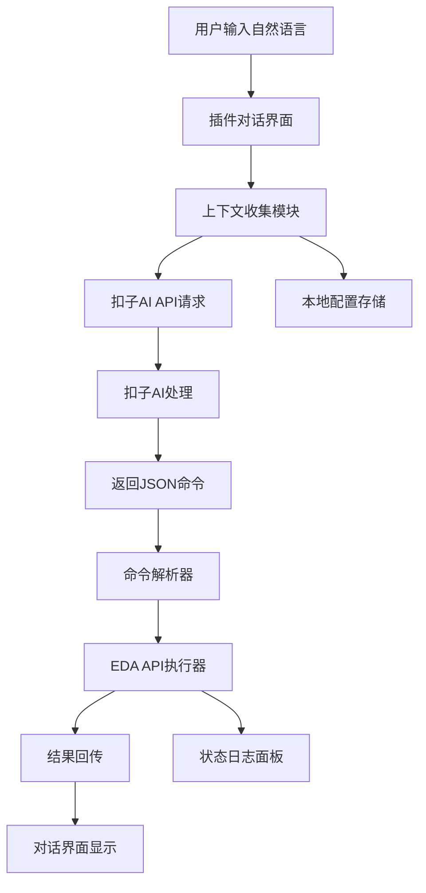
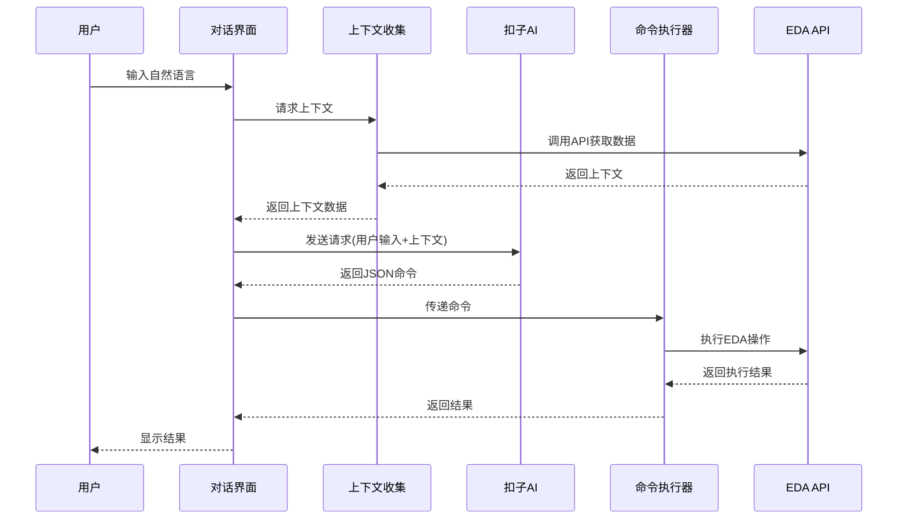

## 产品概述

开发嘉立创EDA专业版与扣子AI平台的交互式集成插件,采用对话式架构实现自然语言驱动的电路设计。用户通过自然语言描述需求,插件将EDA上下文发送给扣子AI,AI返回约定格式的命令并执行,实现多轮对话和上下文管理。

## 核心功能

- 对话式交互界面:显示历史对话记录,支持多轮对话输入与输出
- API配置面板:配置扣子AI平台的API地址、Token等参数
- EDA上下文收集:自动获取当前项目信息、器件库、原理图等上下文数据
- 命令执行器:解析扣子AI返回的JSON格式命令,调用对应的EDA API执行操作
- 状态与日志面板:实时显示命令执行状态、执行日志和错误信息
- 本地配置持久化:使用EDA存储API保存用户配置和对话历史

## 技术栈

- 开发语言: TypeScript 5.7.3
- 构建工具: esbuild
- API文档类型: @jlceda/pro-api-types ^0.1.175
- 前端框架: 原生HTML + CSS (IFrame嵌入)
- EDA API: 全局eda对象(嘉立创EDA专业版插件API)

## 系统架构

### 整体架构



### 模块划分

- **对话界面模块(IFrame)**:负责用户输入输出、历史对话展示、配置面板
- **上下文收集模块**:封装EDA API调用,获取项目、器件、原理图等上下文
- **通信模块**:封装HTTP请求,与扣子AI平台交互
- **命令执行模块**:解析JSON命令,调用对应的EDA API并处理错误
- **状态管理模块**:管理对话历史、配置数据、执行日志

## 数据流



## 实现细节

### 核心目录结构

```
/workspace/
├── src/
│   ├── index.ts              # 入口文件,导出activate和菜单函数
│   ├── services/
│   │   ├── contextService.ts      # EDA上下文收集服务
│   │   ├── cozeApiService.ts      # 扣子AI通信服务
│   │   ├── commandExecutor.ts     # 命令解析与执行服务
│   │   └── storageService.ts      # 本地配置与对话历史存储
│   ├── types/
│   │   ├── command.ts            # 命令类型定义
│   │   ├── context.ts            # 上下文数据类型定义
│   │   └── conversation.ts        # 对话历史类型定义
│   └── utils/
│       └── logger.ts            # 日志工具
├── iframe/
│   ├── index.html              # 主对话界面
│   ├── styles.css              # 样式文件
│   └── app.js                  # 前端逻辑
└── extension.json              # 插件配置(更新菜单和入口)
```

### 关键数据结构

**命令接口**:定义扣子AI返回的命令格式

```typescript
interface CozeCommand {
	id: string;
	action: 'createProject' | 'addDevice' | 'saveDocument' | 'searchDevice' | 'queryProject';
	params: Record<string, any>;
	description?: string;
}
```

**对话消息**:对话历史消息结构

```typescript
interface ConversationMessage {
	role: 'user' | 'assistant' | 'system';
	content: string;
	timestamp: number;
	command?: CozeCommand;
	result?: any;
	error?: string;
}
```

**EDA上下文**:发送给扣子AI的上下文数据

```typescript
interface EDAContext {
	project?: {
		id: string;
		name: string;
		type: string;
	};
	currentDocument?: {
		type: 'sch' | 'pcb';
		id: string;
	};
	userConfig?: {
		apiEndpoint: string;
		apiToken: string;
	};
}
```

### 技术实现方案

#### 1. 上下文收集服务

封装EDA API调用,获取当前项目信息、器件库数据等:

```typescript
class ContextService {
	async getProjectContext(): Promise<EDAContext['project']>;
	async getCurrentDocument(): Promise<EDAContext['currentDocument']>;
	async buildFullContext(): Promise<EDAContext>;
}
```

#### 2. 扣子AI通信服务

使用`eda.sys_ClientUrl.request()`与扣子平台交互:

```typescript
class CozeApiService {
	async sendMessage(userInput: string, context: EDAContext, history: ConversationMessage[]): Promise<CozeCommand>;
	private buildRequestBody(): object;
	private parseResponse(response: any): CozeCommand;
}
```

#### 3. 命令执行服务

解析命令并调用对应的EDA API:

```typescript
class CommandExecutor {
	async execute(command: CozeCommand): Promise<ExecutionResult>;
	private async handleCreateProject(params: any): Promise<any>;
	private async handleAddDevice(params: any): Promise<any>;
	private async handleSearchDevice(params: any): Promise<any>;
	private async handleSaveDocument(params: any): Promise<any>;
	private async handleQueryProject(params: any): Promise<any>;
}
```

#### 4. IFrame通信

使用postMessage实现插件与IFrame页面通信:

```typescript
// index.ts中
export function openCozePanel(): void {
	eda.sys_IFrame.openIFrame({
		title: 'Coze AI Assistant',
		width: 600,
		height: 800,
		url: './iframe/index.html',
	});
}

// iframe/app.js中
window.addEventListener('message', async (event) => {
	if (event.data.type === 'send_message') {
		const result = await callPluginAPI(event.data.payload);
		window.postMessage({ type: 'message_response', result });
	}
});
```

### 集成点

- **插件入口**:在`extension.json`中添加新菜单项,调用`openCozePanel()`
- **IFrame通信**:通过`eda.sys_IFrame`创建对话面板,使用postMessage通信
- **外部API调用**:启用"外部交互"权限后,通过`eda.sys_ClientUrl.request()`调用扣子API
- **数据持久化**:使用`eda.sys_Storage.getExtensionUserConfig()`和`setExtensionUserConfig()`存储配置和历史

## 技术考虑

### 安全措施

- API Token存储在本地用户配置中,不硬编码
- 命令执行前进行参数验证和权限检查
- 限制可执行的EDA API范围,仅允许预定义的安全操作
- 执行错误时提供详细日志但不暴露敏感信息

### 性能优化

- 上下文收集按需获取,避免频繁调用API
- 对话历史限制最近20条,减少请求大小
- 使用防抖处理用户输入,避免频繁请求

### 可扩展性

- 命令执行器采用插件化设计,方便新增命令类型
- 上下文收集模块可扩展支持更多EDA数据类型
- 配置面板支持自定义API端点,便于切换不同AI服务

## 设计风格

采用科技风格的深色主题,营造专业的工程软件氛围。使用深灰色背景、青蓝色主色调、半透明面板效果和细腻的边框阴影。

## 界面规划

### 对话界面

1. 顶部导航栏:插件标题、设置按钮、清除历史按钮
2. 对话历史区域:显示用户和AI的对话消息,支持滚动查看
3. 输入区域:文本输入框、发送按钮

### 配置面板

1. API端点配置:输入框设置扣子AI API地址
2. Token配置:安全输入框设置API Token
3. 保存按钮:保存配置到本地存储

### 状态面板

1. 执行状态:显示当前命令执行状态(空闲/执行中/成功/失败)
2. 执行日志:显示详细的执行日志和错误信息
3. 历史记录:显示最近执行的命令列表

## 视觉效果

- 消息气泡样式区分用户(蓝色)和AI(灰色)
- 加载状态显示动态旋转图标
- 命令执行结果显示折叠面板,展开查看详情
- 错误信息使用红色高亮显示
- 输入框获取焦点时发光效果
- 按钮悬停时颜色渐变效果
