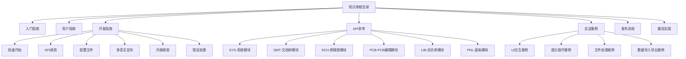
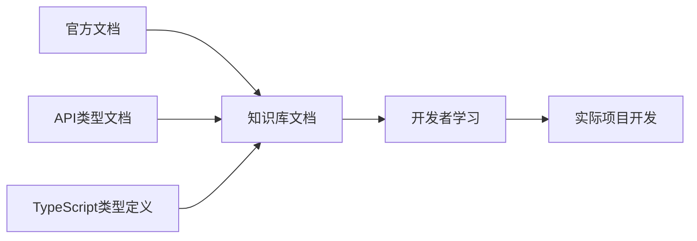

## 产品概述

创建一套完整的嘉立创EDA插件开发知识库文档系统，整合官方开发文档和现有API类型定义，为开发者提供从入门到高级的全方位学习资源。该知识库将保存在 `/workspace/pro-eda-plugin` 目录下，采用结构化的文档组织方式，确保开发者能快速查找和学习所需知识。

## 核心功能

- **入门指南**：快速上手嘉立创EDA插件开发，包含环境搭建、项目创建、基础概念
- **用户指南**：扩展的获取、安装、配置等使用说明
- **开发指南**：核心开发流程，包括API调用、配置文件编写、多语言支持、内联框架、错误处理等
- **API参考手册**：85个API类的完整文档，按6大模块分类（SYS系统、DMT文档树、SCH原理图、PCB编辑、LIB综合库、PNL面板）
- **实战案例集**：常见开发场景的完整代码示例和最佳实践
- **发布流程**：插件打包、测试、发布到扩展商店的完整流程
- **最佳实践**：性能优化、错误处理、安全建议等开发经验总结

## 技术栈

### 文档技术

- **格式**：Markdown
- **源数据**：
- 已有API类型文档（/workspace/pro-api-types/）
- 官方开发文档（https://prodocs.lceda.cn/cn/api/）
- TypeScript类型定义（@jlceda/pro-api-types）

### 系统架构



## 模块划分

### 文档结构模块

- **目录**：`/workspace/pro-eda-plugin/`
- **职责**：整体文档框架和导航
- **核心文件**：
- `README.md` - 知识库首页，包含完整导航和快速链接
- `SUMMARY.md` - 文档目录结构

### 入门指南模块

- **目录**：`/workspace/pro-eda-plugin/01-入门指南/`
- **职责**：帮助新手快速上手
- **核心内容**：
- 开发环境搭建
- 创建第一个插件
- 核心概念介绍
- 开发工具推荐

### 用户指南模块

- **目录**：`/workspace/pro-eda-plugin/02-用户指南/`
- **职责**：扩展的安装和使用
- **核心内容**：
- 获取扩展
- 安装扩展
- 扩展设置

### 开发指南模块

- **目录**：`/workspace/pro-eda-plugin/03-开发指南/`
- **职责**：详细的开发流程和技术细节
- **核心内容**：
- 扩展API介绍
- 如何开始开发
- API调用方式
- 配置文件详解
- 多语言支持
- 内联框架使用
- 错误处理策略

### API参考模块

- **目录**：`/workspace/pro-eda-plugin/04-API参考/`
- **职责**：完整的API文档
- **核心内容**：直接引用 `/workspace/pro-api-types/` 中的85个API类文档，按6大模块组织

### 实战案例模块

- **目录**：`/workspace/pro-eda-plugin/05-实战案例/`
- **职责**：提供可运行的代码示例
- **核心内容**：
- UI交互案例（对话框、消息提示、菜单）
- 图元操作案例（创建、修改、删除PCB/原理图图元）
- 文件处理案例（读写文件、导入导出）
- 数据处理案例（Gerber生成、BOM导出、DRC检查）

### 发布流程模块

- **目录**：`/workspace/pro-eda-plugin/06-发布流程/`
- **职责**：插件发布指导
- **核心内容**：
- 打包配置
- 测试检查清单
- 发布到扩展商店
- 版本管理

### 最佳实践模块

- **目录**：`/workspace/pro-eda-plugin/07-最佳实践/`
- **职责**：经验总结和优化建议
- **核心内容**：
- 代码组织
- 性能优化
- 安全建议
- 调试技巧
- 常见问题

## 数据流



## 实现细节

### 核心文档结构

```
/workspace/pro-eda-plugin/
├── README.md                    # 知识库首页
├── SUMMARY.md                   # 文档目录
├── 01-入门指南/
│   ├── README.md
│   ├── 环境搭建.md
│   ├── 创建第一个插件.md
│   └── 核心概念.md
├── 02-用户指南/
│   ├── README.md
│   ├── 获取扩展.md
│   ├── 安装扩展.md
│   └── 扩展设置.md
├── 03-开发指南/
│   ├── README.md
│   ├── 扩展API介绍.md
│   ├── 快速开始.md
│   ├── API调用.md
│   ├── 配置文件.md
│   ├── 多语言支持.md
│   ├── 内联框架.md
│   └── 错误处理.md
├── 04-API参考/
│   ├── README.md              # API总览
│   ├── SYS-系统/              # 引用 pro-api-types
│   ├── DMT-文档树/
│   ├── SCH-原理图/
│   ├── PCB-PCB编辑/
│   ├── LIB-综合库/
│   └── PNL-面板/
├── 05-实战案例/
│   ├── README.md
│   ├── UI交互案例.md
│   ├── 图元操作案例.md
│   ├── 文件处理案例.md
│   └── 数据处理案例.md
├── 06-发布流程/
│   ├── README.md
│   ├── 打包配置.md
│   ├── 测试清单.md
│   └── 发布到商店.md
└── 07-最佳实践/
    ├── README.md
    ├── 代码组织.md
    ├── 性能优化.md
    ├── 安全建议.md
    └── 常见问题.md
```

### 关键数据结构

**文档元信息接口**

```typescript
interface DocumentMeta {
	title: string; // 文档标题
	description: string; // 文档描述
	category: string; // 所属分类
	tags: string[]; // 标签
	lastUpdate: string; // 最后更新时间
}
```

**API引用接口**

```typescript
interface APIReference {
	module: string; // 模块名称（SYS/DMT/SCH/PCB/LIB/PNL）
	className: string; // 类名
	sourcePath: string; // 源文档路径
	targetPath: string; // 目标路径
}
```

### 技术实现方案

#### 1. 文档整合策略

- **目标**：整合官方文档内容和现有API类型文档
- **方案**：

1. 基于官方文档框架创建目录结构
2. API参考部分直接引用 `/workspace/pro-api-types/` 中的现有文档
3. 开发指南部分整合官方文档核心内容
4. 添加实战案例和最佳实践补充内容

- **步骤**：

1. 创建目录结构
2. 编写导航文档（README、SUMMARY）
3. 创建各模块文档
4. 建立API文档引用链接

#### 2. 文档链接管理

- **目标**：确保文档间链接正确，方便导航
- **方案**：
- 使用相对路径链接
- API参考使用符号链接或相对路径引用现有文档
- 在README中提供快速导航链接
- **实现**：

```markdown
<!-- 链接到API文档 -->

[SYS_Dialog](../04-API参考/SYS-系统/SYS_Dialog.md)

<!-- 链接到现有API文档 -->

[完整API文档](../../pro-api-types/README.md)
```

#### 3. 代码示例组织

- **目标**：提供清晰可运行的代码示例
- **方案**：
- 每个案例包含完整代码
- 添加详细注释说明
- 说明运行环境和依赖
- 提供效果截图描述
- **示例格式**：

```markdown
## 案例：显示自定义对话框

### 功能说明

创建一个包含输入框的自定义对话框

### 代码实现

\`\`\`typescript
// 代码...
\`\`\`

### 使用说明

1. ...
2. ...

### 效果

对话框显示...
```

## 技术考量

### 文档可维护性

- 模块化组织，每个主题独立文件
- 统一的文档格式和结构
- 清晰的命名规范

### 学习路径设计

- 从简单到复杂的递进结构
- 每个章节独立完整，可单独阅读
- 提供快速查询和深度学习两种路径

### 与现有资源整合

- 复用 `/workspace/pro-api-types/` 的API文档
- 引用官方在线文档
- 避免内容重复，保持同步更新

## 代理扩展

### SubAgent

- **code-explorer**
- 目的：深入探索 `/workspace/pro-api-types/` 目录结构和内容，了解现有API文档的组织方式和内容覆盖范围，确保知识库能够正确引用和整合这些资源
- 预期结果：获取完整的API文档列表、模块分类信息、文档内容模式，为知识库的API参考部分提供准确的引用路径和结构设计依据
