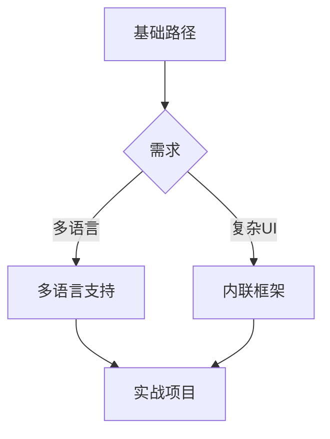

# 开发指南

> 深入了解嘉立创EDA插件开发的核心技术

本章节是插件开发的**核心内容**，涵盖从基础到高级的开发技术。

---

## 📚 章节导航

### [1. 扩展API介绍](./扩展API介绍.md)

⏱️ 15 分钟

了解扩展API的全貌：

- 什么是扩展API
- 能力边界和限制
- API模块分类
- 版本兼容性策略

**适合**: 所有开发者

---

### [2. 快速开始](./快速开始.md)

⏱️ 30 分钟

快速上手开发：

- 📁 项目模板和目录结构
- 📝 编写入口文件
- 🎯 注册菜单命令
- 🐛 调试插件

**适合**: 完成入门指南的开发者

---

### [3. 配置文件详解](./配置文件详解.md)

⏱️ 45 分钟

深入理解 `eext.json`：

- 必填字段说明
- menus 菜单配置
- permissions 权限声明
- 多扩展打包
- 依赖管理

**适合**: 需要自定义配置的开发者

---

### [4. 多语言支持](./多语言支持.md)

⏱️ 30 分钟

实现国际化：

- 📂 多语言资源文件结构
- 🌐 SYS_I18n API 使用
- 🔄 语言切换
- 💡 最佳实践

**适合**: 需要多语言的插件开发者

---

### [5. 内联框架](./内联框架.md)

⏱️ 1 小时

创建丰富的UI界面：

- 🖼️ 什么是内联框架
- 🔌 SYS_IFrame API
- 💬 消息通信机制
- ⚛️ React/Vue 集成
- 📝 完整示例

**适合**: 需要复杂UI的插件开发者

---

### [6. 错误处理](./错误处理.md)

⏱️ 30 分钟

构建健壮的插件：

- Try/Catch 使用
- Promise 错误处理
- 全局异常监听
- 📊 SYS_Log 日志记录
- 🚨 错误上报
- 💬 用户友好提示

**适合**: 所有开发者

---

## 🎯 学习路径

### 基础路径（必学）


**目标**: 能够开发基本功能的插件

---

### 进阶路径（选学）



**目标**: 开发功能完善、用户体验好的插件

---

## 💡 核心概念速览

### API 模块分类

| 模块 | 功能               | 常用度     |
| ---- | ------------------ | ---------- |
| SYS  | 系统交互、UI、文件 | ⭐⭐⭐⭐⭐ |
| DMT  | 工程和文档管理     | ⭐⭐⭐⭐⭐ |
| PCB  | PCB编辑操作        | ⭐⭐⭐⭐   |
| SCH  | 原理图编辑操作     | ⭐⭐⭐⭐   |
| LIB  | 库管理             | ⭐⭐⭐     |
| PNL  | 面板操作           | ⭐⭐       |

详细信息请查看 [扩展API介绍](./扩展API介绍.md)

---

### 插件生命周期

```typescript
// 插件激活时调用
export function activate(api: any) {
	console.log('插件已激活');

	// 注册命令
	api.registerCommand('myCommand', () => {
		// 命令处理逻辑
	});
}

// 插件停用时调用
export function deactivate() {
	console.log('插件已停用');
	// 清理资源
}
```

---

### 权限系统

插件需要在 `eext.json` 中声明权限：

```json
{
	"permissions": {
		"filesystem": true, // 文件系统访问
		"network": true, // 网络请求
		"clipboard": true // 剪贴板访问
	}
}
```

---

## 🔧 开发工具推荐

### IDE

- **VS Code** (推荐)
    - 安装 ESLint 插件
    - 安装 TypeScript 插件
    - 安装 Prettier 插件

### 调试工具

- Chrome DevTools（内联框架调试）
- VS Code 调试器（TypeScript调试）
- SYS_Log（日志输出）

---

## 📦 常用依赖

```bash
# TypeScript 类型定义
npm install @jlceda/pro-api-types

# 开发依赖
npm install --save-dev typescript @types/node

# UI 框架（可选）
npm install react react-dom
# 或
npm install vue
```

---

## 🎓 学习建议

### 推荐顺序

1. **先读前3章**（扩展API介绍、快速开始、配置文件）
2. **完成一个简单插件**（参考 [实战案例](../05-实战案例/README.md)）
3. **根据需求学习**（多语言、内联框架）
4. **阅读最佳实践**（[最佳实践](../07-最佳实践/README.md)）

### 实践为主

- 每学完一章，尝试实现一个小功能
- 参考 [实战案例](../05-实战案例/README.md) 进行练习
- 查阅 [API参考](../04-API参考/README.md) 了解详细用法

---

## 🆘 获取帮助

- 📖 查看 [常见问题FAQ](../07-最佳实践/常见问题.md)
- 📚 查阅 [API参考文档](../04-API参考/README.md)
- 💬 访问 [官方论坛](https://club.szlcsc.com/)
- 🌐 查看 [官方文档](https://prodocs.lceda.cn/cn/api/)

---

## 下一步

选择您感兴趣的章节开始学习：

- 🔰 新手推荐 → [扩展API介绍](./扩展API介绍.md)
- 🚀 快速开发 → [快速开始](./快速开始.md)
- ⚙️ 深度定制 → [配置文件详解](./配置文件详解.md)

---

<p align="center">
  <a href="../README.md">🏠 返回首页</a> • 
  <a href="./扩展API介绍.md">开始学习 →</a>
</p>
