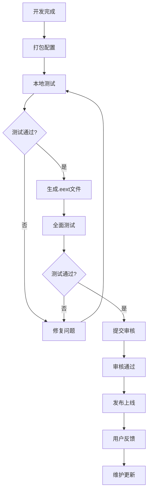

# 发布流程

> 从开发到上线的完整发布指南

本章节指导您如何将插件打包、测试并发布到嘉立创EDA扩展商店。

---

## 📚 章节导航

### [1. 打包配置](./打包配置.md)

⏱️ 30 分钟

准备发布前的配置工作：

- ✅ 打包前检查清单
- ✅ package.json 配置
- ✅ eext.json 完善
- ✅ 资源文件整理
- ✅ 打包命令
- ✅ 测试 .eext 文件

---

### [2. 测试清单](./测试清单.md)

⏱️ 1-2 小时

全面测试您的插件：

- ✅ 功能测试
- ✅ 兼容性测试
- ✅ 性能测试
- ✅ 安全测试
- ✅ 用户体验测试

---

### [3. 发布到商店](./发布到商店.md)

⏱️ 30 分钟

将插件发布到扩展商店：

- ✅ 注册开发者账号
- ✅ 提交扩展
- ✅ 审核要求
- ✅ 版本更新
- ✅ 发布后维护

---

## 🚀 快速发布流程



---

## ✅ 发布前检查清单

### 必做项

- [ ] 功能完整，无明显bug
- [ ] 已通过本地测试
- [ ] `eext.json` 配置完整
- [ ] 版本号符合规范
- [ ] 包含 README 说明
- [ ] 图标和资源文件齐全
- [ ] 权限声明合理
- [ ] 多语言翻译完整（如支持）

### 推荐项

- [ ] 代码已格式化
- [ ] 添加了使用文档
- [ ] 提供了示例
- [ ] 性能已优化
- [ ] 错误处理完善
- [ ] 日志记录合理

---

## 📦 打包要点

### 文件结构

```
my-plugin/
├── eext.json           # 必需：配置文件
├── package.json        # 必需：npm配置
├── dist/               # 必需：编译后的代码
│   └── index.js
├── assets/             # 可选：资源文件
│   ├── icon.png
│   └── images/
├── locales/            # 可选：多语言
│   ├── zh-CN.json
│   └── en-US.json
└── README.md           # 推荐：说明文档
```

### 配置要点

**eext.json 必填字段**：

```json
{
	"name": "my-plugin",
	"version": "1.0.0",
	"displayName": "我的插件",
	"description": "插件描述",
	"main": "dist/index.js",
	"icon": "assets/icon.png",
	"author": "你的名字",
	"publisher": "你的ID"
}
```

详见：[打包配置](./打包配置.md)

---

## 🧪 测试要点

### 功能测试

- ✅ 所有功能正常工作
- ✅ 边界情况处理正确
- ✅ 错误提示友好

### 兼容性测试

- ✅ 在不同EDA版本测试
- ✅ 在不同操作系统测试（Windows/Mac/Linux）
- ✅ 与其他插件共存

### 性能测试

- ✅ 启动时间 < 1秒
- ✅ 操作响应快速
- ✅ 内存占用合理

详见：[测试清单](./测试清单.md)

---

## 📢 发布注意事项

### 审核要求

- ✅ 遵守平台规范
- ✅ 不包含恶意代码
- ✅ 权限申请合理
- ✅ 描述真实准确
- ✅ 图标清晰美观

### 版本规范

遵循语义化版本号（Semantic Versioning）：

- `1.0.0` - 主版本号.次版本号.修订号
- `1.0.0 → 1.0.1` - 修复bug
- `1.0.0 → 1.1.0` - 新增功能（向下兼容）
- `1.0.0 → 2.0.0` - 重大变更（可能不兼容）

---

## 🔄 发布后维护

### 用户反馈

- 及时回复用户评论
- 收集使用反馈
- 记录bug报告

### 版本更新

- 定期修复bug
- 添加新功能
- 提升性能
- 改善用户体验

### 文档维护

- 更新使用文档
- 添加常见问题
- 提供示例代码

---

## 📊 发布统计

发布后可以查看：

- 📥 下载量
- ⭐ 用户评分
- 💬 用户评论
- 📈 使用趋势

---

## 🎓 发布建议

### 首次发布

1. **从简单开始** - 先发布核心功能
2. **充分测试** - 确保质量
3. **详细文档** - 帮助用户上手
4. **积极回复** - 建立良好口碑

### 版本迭代

1. **小步快跑** - 频繁发布小更新
2. **收集反馈** - 倾听用户声音
3. **持续改进** - 不断优化体验
4. **保持兼容** - 避免破坏性变更

---

## 🔗 相关资源

- 📚 [打包配置详解](./打包配置.md)
- ✅ [测试清单](./测试清单.md)
- 🏪 [扩展商店](https://pro.lceda.cn/extension)
- 📖 [发布指南](./发布到商店.md)
- 💬 [开发者社区](https://club.szlcsc.com/)

---

## 🆘 遇到问题？

- 📖 查看 [常见问题FAQ](../07-最佳实践/常见问题.md#打包和发布问题)
- 💬 访问 [官方论坛](https://club.szlcsc.com/)
- 📧 联系技术支持

---

<p align="center">
  <a href="../README.md">🏠 返回首页</a> • 
  <a href="./打包配置.md">开始准备发布 →</a>
</p>
