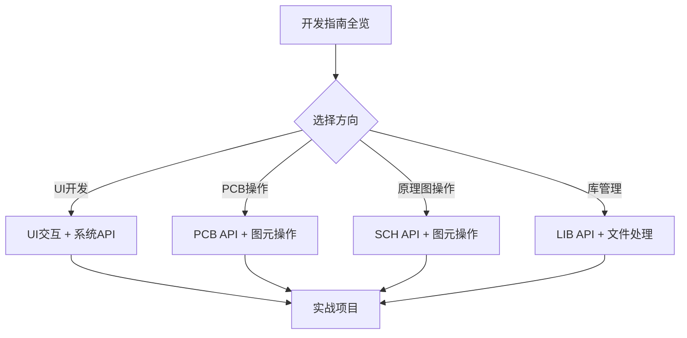

# 嘉立创EDA插件开发知识库

> 完整的嘉立创EDA专业版扩展开发指南 - 从入门到精通

---

## 🚀 快速导航

<table>
<tr>
<td width="33%">

### 📖 [入门指南](./01-入门指南/README.md)

- [环境搭建](./01-入门指南/环境搭建.md)
- [创建第一个插件](./01-入门指南/创建第一个插件.md)
- [核心概念](./01-入门指南/核心概念.md)

</td>
<td width="33%">

### 👤 [用户指南](./02-用户指南/README.md)

- [获取扩展](./02-用户指南/获取扩展.md)
- [安装扩展](./02-用户指南/安装扩展.md)
- [扩展设置](./02-用户指南/扩展设置.md)

</td>
<td width="34%">

### 💻 [开发指南](./03-开发指南/README.md)

- [扩展API介绍](./03-开发指南/扩展API介绍.md)
- [快速开始](./03-开发指南/快速开始.md)
- [配置文件详解](./03-开发指南/配置文件详解.md)
- [更多...](./03-开发指南/README.md)

</td>
</tr>
</table>

<table>
<tr>
<td width="50%">

### 📚 [API参考](./04-API参考/README.md)

完整的85个API类文档，按6大模块分类：

- [SYS - 系统模块](./04-API参考/README.md#sys-系统) (25类)
- [DMT - 文档树模块](./04-API参考/README.md#dmt-文档树) (10类)
- [PCB - PCB编辑模块](./04-API参考/README.md#pcb-pcb编辑) (24类)
- [SCH - 原理图模块](./04-API参考/README.md#sch-原理图) (17类)
- [LIB - 综合库模块](./04-API参考/README.md#lib-综合库) (8类)
- [PNL - 面板模块](./04-API参考/README.md#pnl-面板) (1类)

</td>
<td width="50%">

### 💡 [实战案例](./05-实战案例/README.md)

真实场景的完整代码示例：

- [UI交互案例](./05-实战案例/UI交互案例.md)
- [图元操作案例](./05-实战案例/图元操作案例.md)
- [文件处理案例](./05-实战案例/文件处理案例.md)
- [数据处理案例](./05-实战案例/数据处理案例.md)

</td>
</tr>
</table>

<table>
<tr>
<td width="50%">

### 📦 [发布流程](./06-发布流程/README.md)

- [打包配置](./06-发布流程/打包配置.md)
- [测试清单](./06-发布流程/测试清单.md)
- [发布到商店](./06-发布流程/发布到商店.md)

</td>
<td width="50%">

### ⚡ [最佳实践](./07-最佳实践/README.md)

- [代码组织](./07-最佳实践/代码组织.md)
- [性能优化](./07-最佳实践/性能优化.md)
- [安全建议](./07-最佳实践/安全建议.md)
- [常见问题FAQ](./07-最佳实践/常见问题.md)

</td>
</tr>
</table>

---

## 📋 完整目录

查看 [**SUMMARY.md**](./SUMMARY.md) 获取完整的文档目录树。

---

## 🎯 学习路径推荐

### 新手入门路径 (1-2天)

**推荐阅读顺序**：

1. 📖 [环境搭建](./01-入门指南/环境搭建.md) - 30分钟
2. 📖 [核心概念](./01-入门指南/核心概念.md) - 20分钟
3. 📖 [创建第一个插件](./01-入门指南/创建第一个插件.md) - 1小时
4. 💻 [快速开始](./03-开发指南/快速开始.md) - 1小时
5. 💡 [UI交互案例](./05-实战案例/UI交互案例.md) - 选读

### 进阶开发路径 (3-5天)

**推荐阅读顺序**：

1. 💻 [配置文件详解](./03-开发指南/配置文件详解.md)
2. 💻 [多语言支持](./03-开发指南/多语言支持.md)
3. 💻 [内联框架](./03-开发指南/内联框架.md)
4. 📚 根据需求查阅 [API参考](./04-API参考/README.md)
5. 💡 学习相关 [实战案例](./05-实战案例/README.md)
6. ⚡ 阅读 [最佳实践](./07-最佳实践/README.md)

### 高级优化路径 (持续学习)

**推荐阅读顺序**：

1. ⚡ [性能优化](./07-最佳实践/性能优化.md)
2. ⚡ [安全建议](./07-最佳实践/安全建议.md)
3. 💻 [错误处理](./03-开发指南/错误处理.md)
4. 📦 [发布流程](./06-发布流程/README.md)

---

## 🔍 快速查询

### 常用API速查

| 功能           | API类               | 文档链接                                                       |
| -------------- | ------------------- | -------------------------------------------------------------- |
| 显示对话框     | SYS_Dialog          | [API文档](../pro-api-types/SYS-系统/SYS_Dialog.md)             |
| 文件操作       | SYS_FileSystem      | [API文档](../pro-api-types/SYS-系统/SYS_FileSystem.md)         |
| 消息通知       | SYS_Message         | [API文档](../pro-api-types/SYS-系统/SYS_Message.md)            |
| 获取工程信息   | DMT_Project         | [API文档](../pro-api-types/DMT-文档树/DMT_Project.md)          |
| PCB文档操作    | PCB_Document        | [API文档](../pro-api-types/PCB-PCB编辑/PCB_Document.md)        |
| 原理图文档操作 | SCH_Document        | [API文档](../pro-api-types/SCH-原理图/SCH_Document.md)         |
| 器件搜索       | LIB_Device          | [API文档](../pro-api-types/LIB-综合库/LIB_Device.md)           |
| 导出Gerber     | PCB_ManufactureData | [API文档](../pro-api-types/PCB-PCB编辑/PCB_ManufactureData.md) |

### 常见场景示例

| 场景             | 示例代码                            | 文档链接                                                   |
| ---------------- | ----------------------------------- | ---------------------------------------------------------- |
| 创建自定义对话框 | `SYS_Dialog.showInputDialog()`      | [UI交互案例](./05-实战案例/UI交互案例.md#创建自定义对话框) |
| 在PCB中画线      | `PCB_PrimitiveLine.create()`        | [图元操作案例](./05-实战案例/图元操作案例.md#pcb绘制直线)  |
| 读取文件         | `SYS_FileSystem.readFile()`         | [文件处理案例](./05-实战案例/文件处理案例.md#读取文件)     |
| 导出BOM          | `PCB_ManufactureData.getBom()`      | [数据处理案例](./05-实战案例/数据处理案例.md#导出bom)      |
| 监听图元变化     | `PCB_Event.on('PrimitivesChanged')` | [实战案例](./05-实战案例/图元操作案例.md#监听图元变化)     |

---

## 📦 资源链接

- **官方文档**: [https://prodocs.lceda.cn/cn/api/](https://prodocs.lceda.cn/cn/api/)
- **API类型库**: [../pro-api-types/](../pro-api-types/)
- **扩展商店**: [嘉立创EDA扩展广场](https://pro.lceda.cn/extension)
- **GitHub仓库**: [pro-api-sdk](https://github.com/lceda/pro-api-sdk) (示例参考)
- **TypeScript类型**: `@jlceda/pro-api-types` (npm包)

---

## 💬 社区支持

- **官方论坛**: [立创开发者社区](https://club.szlcsc.com/)
- **问题反馈**: [GitHub Issues](https://github.com/lceda/pro-api-sdk/issues)
- **技术交流**: 嘉立创EDA开发者QQ群

---

## 📊 知识库统计

- **文档总数**: 40+ 个主题文档
- **API文档**: 85 个类完整文档
- **代码示例**: 30+ 个实战案例
- **模块数**: 6 大功能模块
- **最后更新**: 2026年1月

---

## 📝 贡献指南

本知识库是开放的学习资源。如果您发现错误或有改进建议：

1. 提交 Issue 描述问题
2. Fork 仓库并修改
3. 提交 Pull Request

---

## ⚠️ 注意事项

- 🔶 **Beta API**: 部分API标记为 ⚠️ Beta 阶段，可能在未来版本中变更
- 📐 **单位系统**: 原理图使用 0.01inch，PCB使用 mil
- 🔄 **异步操作**: 大部分API返回 Promise，需使用 async/await
- 🔐 **权限管理**: 文件访问、网络请求需在配置文件中声明权限

详见：[扩展API介绍](./03-开发指南/扩展API介绍.md)

---

## 📄 许可证

本知识库内容基于嘉立创官方文档和公开API整理，仅供学习参考。

API类型定义版权归嘉立创所有。

---

  <strong>开始您的插件开发之旅！</strong> 
  <a href="./01-入门指南/README.md">📖 入门指南</a> • 
  <a href="./03-开发指南/快速开始.md">💻 快速开始</a> • 
  <a href="./04-API参考/README.md">📚 API参考</a>

